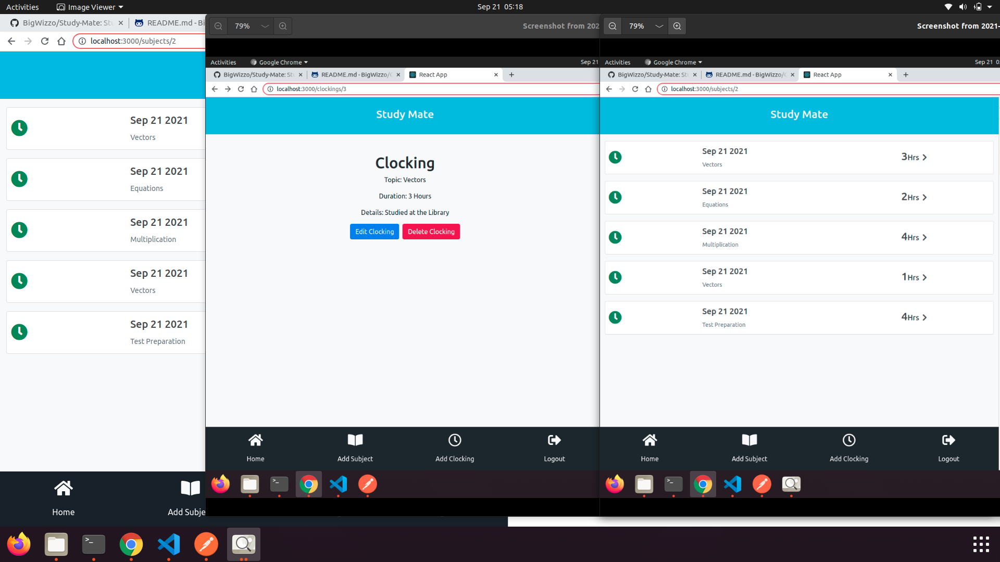

# STUDY MATE

> This application helps students clock in their studies based on their subjects. They can track the number of hours they spend studying a specific subject. The app allows students to clock in their non-academic activities as well. Students can create many subjects as well as many clockings. They can create many clockings per subject.

## Built With

- React
- Redux
- redux sagas
- Persist
- Bootstrap
- CSS

### Tested With

- Jest
- react-testing-library

## Check the Live Version

Open [Live Version Link](https://study-mate-frontend.netlify.app/login)

### Prerequisites

- React
- Yarn / npm

## Getting Started

To get a local copy up and running follow these simple example steps.

### Setup

- Open the console
- Download or `git clone https://github.com/bigWizzo/Study-Mate.git`
- cd Study-Mate
- run `npm install`
- run `npm start`
- Open `http://localhost:3000/` in your browser.

### Run Tests

- run `npm run test`

## Authors

👤 **Will Nyamunokora**

- Github: [@bigwizzo](https://github.com/bigwizzo)
- Twitter: [@willnyamunokora](https://twitter.com/willnyamunokora)
- Linkedin: [@willnyamunokora](https://linkedin.com/in/willnyamunokora)

## 🤝 Contributing

Contributions, issues and feature requests are welcome!

Feel free to check the [issues page](https://github.com/bigWizzo/Study-Mate/issues).

## Show your support

Give a ⭐️ if you like this project!

## Acknowledgments

- Microverse
- Stand up Team
- TSEs

## 📝 License

This project is [MIT](https://opensource.org/licenses/MIT) licensed.
